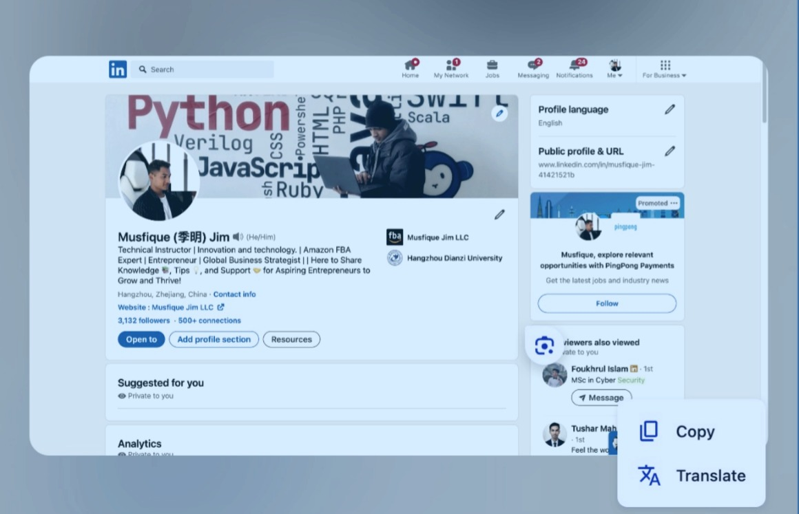

# Awesome README [)](https://github.com/sindresorhus/awesome#readme)

> A curated list of awesome READMEs

Elements in beautiful READMEs include, but are not limited to:

images, screenshots, GIFs, text formatting, etc.
   
## Examples

Our Projects and Products
We provide a diverse array of digital tools and resources, designed to enhance user experience and streamline development. Here's a selection of some of our top projects that help businesses and developers achieve more:

[Securely manage user authentication and authorization](http://www.example.com)

Use this for implementing secure authentication with OpenID Connect, ideal for user management and secure logins in a media platform.

[Optimize JavaScript bundle size for faster performance](https://github.com/ai/size-limit)

A must-have tool for optimizing website performance by limiting the size of JavaScript files, improving the load time of media content.

[TYPO3 CMS](aimeos/aimeos-typo3)
A powerful e-commerce platform designed for TYPO3, perfect for creating a seamless online store for your media products.

[Accelerate navigation in the terminal with a smarter directory traversal tool](https://github.com/ajeetdsouza/zoxide)
An efficient way to quickly navigate large codebases, ensuring faster updates and enhancements to your media site.

[Efficiently back up your data with minimal storage space](https://github.com/alichtman/shallow-backup)
Ideal for easy backup of all your media and project files, ensuring data integrity and security for your website’s content.

[automated security tool](https://github.com/alichtman/stronghold)
Protect your media website by implementing advanced security measures, preventing unauthorized access to sensitive content.

[Stronghold Image Toolbox PreV1b](https://stronghold.heavengames.com/downloads/showfile.php?fileid=4474)
Animation encoding is glitchy.This application allows you to extract and inject images in the TGX and GM1 files.
A great solution for managing user data and interactions on a media platform, providing API support for engagement and content delivery.

## Musfique Jim's Contribution: 
As a backend engineer, Musfique Jim plays a crucial role in building and maintaining the technical infrastructure behind many of these projects. He is also actively involved in creating pipelines for sentiment analysis tools, helping to enhance data-driven solutions.

Each of these projects exemplifies excellence in usability, design, and functionality, making complex tasks simpler and delivering an enhanced user experience.

## License

## Check out www.musfiquellc.com for innovative solutions and expert services designed to elevate your business.
